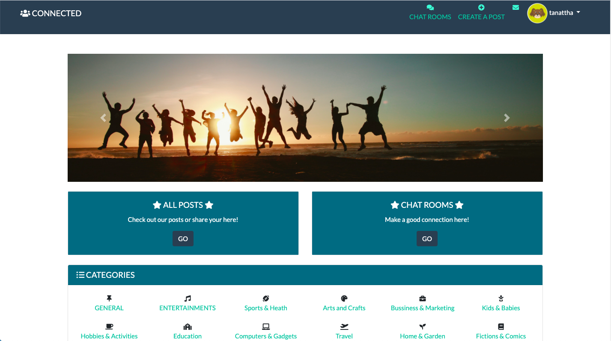

# Connected

Welcome to Connected! All-in-one community web application! This app is fully functional MVC and CRUD operations, using Ruby on Rails and display by HTML, CSS, JS and bootstraped. 

## Overview

Connected is a place to let everyone connect to each other. Either through posts, comments, messages or chat rooms.

## Live App
https://rails-connected.herokuapp.com/

## Diagram
[Check out an application diagram here](db/connected_diagram.png)

## Video Walkthrough

Click here a video walkthrough: https://youtu.be/lFZFHlJxxW8

## Installation

Fork and clone this repo then create a database

    $ rail db:create

Seed the database

    $ rake db:seed

Startup the server

    $ rails s

View on browser

    $  localhost:3000

## Usage

Users can see all posts and comments but log in needed for chat rooms and any action.

## License

The gem is available as open source under the terms of the [MIT License](https://opensource.org/licenses/MIT).
